# 📋 Panduan Pengisian Google Spreadsheet — ToramCodex

Dokumen ini menjelaskan cara mengisi setiap tab sheet pada Google Spreadsheet
agar data tampil dengan benar di website ToramCodex.

> **Penting:**
> - Baris 1 **HARUS** berisi header kolom (persis seperti tabel di bawah).
> - Data mulai dari baris 2 ke bawah.
> - Kolom **Icon** dan **ImageURL** bersifat opsional — jika dikosongkan, sistem
>   otomatis memilih emoji berdasarkan kolom Type.
> - Setelah mengedit Sheet, data di website otomatis terupdate saat halaman di-refresh
>   (tidak perlu push code).

---

## 📑 Daftar Tab Sheet

| No | Nama Tab      | Halaman Website          |
|----|---------------|--------------------------|
| 1  | Items         | Items Database           |
| 2  | ItemDetails   | Modal popup detail item  |
| 3  | Monsters      | Monsters Database        |
| 4  | Skills        | Skills Database          |
| 5  | Maps          | Maps Database            |
| 6  | Quests        | Quests Database          |
| 7  | Pets          | Pets Database            |
| 8  | Homepage      | Halaman utama (Home)     |

> Nama tab **harus persis** seperti di atas (huruf besar/kecil penting).

---

## 1️⃣ Tab: Items

Daftar semua item/equipment yang ditampilkan sebagai card di halaman Items.

### Header Kolom

| Name | Icon | ImageURL | Type | Level | Stats | Rarity | Source |
|------|------|----------|------|-------|-------|--------|--------|

### Penjelasan Kolom

| Kolom    | Wajib? | Keterangan                                              |
|----------|--------|---------------------------------------------------------|
| Name     | ✅ Ya  | Nama item                                                |
| Icon     | ❌     | Emoji kustom (misal: ⚔️). Kosongkan = auto dari Type    |
| ImageURL | ❌     | URL gambar item (misal dari Imgur). Kosongkan = pakai emoji |
| Type     | ✅ Ya  | Jenis item. Menentukan icon otomatis & filter kategori   |
| Level    | ❌     | Level requirement item                                   |
| Stats    | ❌     | Stat utama item (misal: ATK+350)                        |
| Rarity   | ❌     | Kelangkaan: Common, Rare, Legendary, Epic               |
| Source   | ❌     | Sumber mendapatkan item                                  |

### Type yang Didukung (Auto Icon)

| Type              | Icon                  | Type              | Icon                  |
|-------------------|-----------------------|-------------------|-----------------------|
| 1 Handed Sword    | 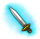     | Shield            |  |
| 2 Handed Sword    | 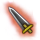     | Armor             | 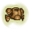  |
| Bow               | 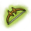    | Heavy Armor       |   |
| Bowgun            | 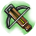    | Light Armor       |   |
| Staff             | 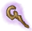    | Ring              | 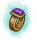|
| Magic Device      | 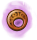     | Additional        | 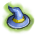    |
| Knuckles          | 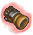    | Special           | |
| Halberd           | 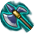     | Ninjutsu Scroll   | 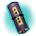 |
| Katana            | 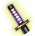    | Material          | ⛏️                    |
| Dagger            | 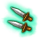 | Consumable        | 🧪                    |
| Arrow             | 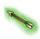  | Quest Item        | 📦                    |

#### Crysta Types

| Type              | Icon                  |
|-------------------|-----------------------|
| Additional Crysta | 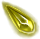     |
| Ring Crysta       |      |
| Armor Crysta      | 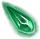   |
| Weapon Crysta     | 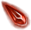  |
| Special Crysta    | 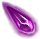 |
| Normal Crysta     |   |

### Contoh Data

| Name                | Icon | ImageURL | Type            | Level | Stats   | Rarity    | Source                  |
|---------------------|------|----------|-----------------|-------|---------|-----------|-------------------------|
| 10th Anniv Sword IV |      |          | 1 Handed Sword  | 0     | 485     | Common    | Event 10th Anniversary  |
| Gale Arch Bow       |      |          | Bow             | 230   | ATK+280 | Rare      | Boss Drop: Venena Coenubia |
| Darkness Staff      |      |          | Staff           | 200   | MATK+320| Legendary | Boss Drop: Dark Dragon  |
| Titan's Fist        |      |          | Knuckles        | 245   | ATK+400 | Epic      | World Boss: Gravicep    |
| Iron Ore            |      |          | Material        | 0     |         | Common    | Mining                  |
| HP Potion 5000      |      |          | Consumable      | 0     | HP+5000 | Common    | NPC Shop                |
| Sakura Katana       | 🌸   |          | Katana          | 220   | ATK+310 | Rare      | Event: Spring Festival  |
| Crystal Shield      |      |          | Shield          | 210   | DEF+180 | Rare      | Boss Drop: Crystal Golem|

---

## 2️⃣ Tab: ItemDetails

Data detail yang muncul saat klik item (popup modal). Nama item harus **sama persis**
dengan tab Items agar terhubung.

### Header Kolom

| Name | Icon | Type | Level | ImageURL | SellSpina | SellOther | Stats | Obtain | Recipe |
|------|------|------|-------|----------|-----------|-----------|-------|--------|--------|

### Penjelasan Kolom

| Kolom     | Wajib? | Keterangan                                              |
|-----------|--------|---------------------------------------------------------|
| Name      | ✅ Ya  | Nama item (harus sama dengan tab Items)                 |
| Icon      | ❌     | Emoji kustom                                             |
| Type      | ✅ Ya  | Jenis item                                               |
| Level     | ❌     | Level requirement                                        |
| ImageURL  | ❌     | URL gambar                                               |
| SellSpina | ❌     | Harga jual dalam Spina                                   |
| SellOther | ❌     | Harga jual lainnya (misal: Medal, Orbs)                 |
| Stats     | ❌     | Detail stat lengkap, dipisah titik koma (`;`)           |
| Obtain    | ❌     | Cara mendapatkan, dipisah titik koma (`;`)              |
| Recipe    | ❌     | Bahan crafting, dipisah titik koma (`;`)                |

### Format Khusus

**Stats** — gunakan format `NamaStat:Nilai` dipisah `;`
```
ATK:+350;CRIT Rate:+15%;Aspd:+800
```

Untuk conditional stats (misal bonus saat pakai armor tertentu), tambahkan `>` di depan:
```
ATK:+350;CRIT Rate:+15%;>With Light Armor:Aspd:+15%
```

**Obtain** — cara mendapatkan, dipisah `;`
```
Drop: Venena Coenubia;Quest: Dragon Slayer;NPC: Blacksmith Lefina
```

**Recipe** — bahan crafting, dipisah `;`
```
Iron Ore x3;Dragon Scale x1;Magic Crystal x2
```

### Contoh Data

| Name                | Icon | Type           | Level | ImageURL | SellSpina | SellOther | Stats                                   | Obtain                              | Recipe                              |
|---------------------|------|----------------|-------|----------|-----------|-----------|-----------------------------------------|--------------------------------------|--------------------------------------|
| 10th Anniv Sword IV |      | 1 Handed Sword | 0     |          | 1         |           | ATK:+485;Aspd:+800;CRIT Rate:+10%      | Event: 10th Anniversary              |                                      |
| Gale Arch Bow       |      | Bow            | 230   |          | 52000     |           | ATK:+280;Aspd:+950;DEX:+5%             | Drop: Venena Coenubia                | Beast Bone x5;Wind Crystal x3       |
| Darkness Staff      |      | Staff          | 200   |          | 40000     | Medal x5  | MATK:+320;MaxMP:+200;>Staff Mastery:MATK:+10% | Boss Drop: Dark Dragon;Quest: Shadow Path | Dark Ore x3;Shadow Gem x2;Magic Cloth x1 |

---

## 3️⃣ Tab: Monsters

Daftar monster yang ditampilkan sebagai tabel di halaman Monsters.

### Header Kolom

| Name | Icon | ImageURL | Level | Type | Element | HP | Location | Drop |
|------|------|----------|-------|------|---------|----|----------|------|

### Penjelasan Kolom

| Kolom    | Wajib? | Keterangan                                              |
|----------|--------|---------------------------------------------------------|
| Name     | ✅ Ya  | Nama monster                                             |
| Icon     | ❌     | Emoji kustom. Kosongkan = 👾 (normal) atau 🐉 (boss)    |
| ImageURL | ❌     | URL gambar monster                                       |
| Level    | ✅ Ya  | Level monster (≥240 otomatis gold badge)                 |
| Type     | ✅ Ya  | Normal, Mini Boss, Boss (Boss otomatis merah)            |
| Element  | ❌     | Elemen: Fire, Water, Wind, Earth, Light, Dark, Neutral   |
| HP       | ❌     | Jumlah HP                                                |
| Location | ❌     | Lokasi spawn                                             |
| Drop     | ❌     | Item drop utama                                          |

### Contoh Data

| Name             | Icon | ImageURL | Level | Type      | Element | HP        | Location            | Drop                    |
|------------------|------|----------|-------|-----------|---------|-----------|---------------------|-------------------------|
| Pom-Pom Pom      |      |          | 1     | Normal    | Neutral | 50        | Sofya City Outskirts| Pom Pom Fur             |
| Colon            |      |          | 5     | Normal    | Water   | 200       | Ruined Temple       | Colon Jelly             |
| Venena Coenubia  |      |          | 230   | Boss      | Dark    | 5000000   | El Scaro            | Gale Arch Bow           |
| Gravicep         |      |          | 250   | Boss      | Earth   | 12000000  | Ultimea Palace      | Titan's Fist            |
| Shadow Puppet    |      |          | 180   | Mini Boss | Dark    | 800000    | Dark Castle         | Shadow Gem              |
| Fire Willow      |      |          | 120   | Normal    | Fire    | 50000     | Lava Valley         | Fire Crystal            |
| Crystal Golem    |      |          | 210   | Boss      | Earth   | 3000000   | Crystal Cave        | Crystal Shield          |

---

## 4️⃣ Tab: Skills

Daftar skill yang ditampilkan sebagai card di halaman Skills.

### Header Kolom

| Name | Icon | ImageURL | Type | Category | Damage | MP Cost | Description |
|------|------|----------|------|----------|--------|---------|-------------|

### Penjelasan Kolom

| Kolom       | Wajib? | Keterangan                                              |
|-------------|--------|---------------------------------------------------------|
| Name        | ✅ Ya  | Nama skill                                               |
| Icon        | ❌     | Emoji kustom                                             |
| ImageURL    | ❌     | URL gambar skill                                         |
| Type        | ✅ Ya  | Tipe senjata: Sword, Bow, Staff, Knuckle, dll (filter 1)|
| Category    | ❌     | Kategori: Attack, Buff, Debuff, Passive, Support (filter 2) |
| Damage      | ❌     | Nilai damage (misal: 500%, Low, High)                   |
| MP Cost     | ❌     | Biaya MP                                                 |
| Description | ❌     | Deskripsi singkat skill                                  |

### Contoh Data

| Name            | Icon | ImageURL | Type   | Category | Damage | MP Cost | Description                                    |
|-----------------|------|----------|--------|----------|--------|---------|------------------------------------------------|
| Meteor Breaker  |      |          | Sword  | Attack   | 600%   | 400     | Powerful single-target sword strike             |
| Arrow Rain      |      |          | Bow    | Attack   | 350%   | 300     | Rains arrows on enemies in a wide area          |
| Storm           |      |          | Staff  | Attack   | 500%   | 450     | Summons a storm dealing wind damage             |
| Power Wave      |      |          | Sword  | Attack   | 200%   | 100     | Basic sword wave attack                         |
| Quick Aura      |      |          | Buff   | Buff     |        | 200     | Increases party attack speed by 30%             |
| Berserk         |      |          | Knuckle| Buff     |        | 150     | Boosts ATK by 50% but reduces DEF              |
| Healing         |      |          | Staff  | Support  |        | 250     | Restores HP of a single target                  |
| Defense Break   |      |          | Sword  | Debuff   |        | 180     | Reduces target DEF by 30% for 15 seconds       |
| Backstep        |      |          | Bow    | Passive  |        | 0       | Dodge backward, temporarily increases evasion   |

---

## 5️⃣ Tab: Maps

Daftar peta/lokasi yang ditampilkan sebagai card di halaman Maps.

### Header Kolom

| Name | Icon | ImageURL | Zone | LevelRange | Boss | Description |
|------|------|----------|------|------------|------|-------------|

### Penjelasan Kolom

| Kolom      | Wajib? | Keterangan                                              |
|------------|--------|---------------------------------------------------------|
| Name       | ✅ Ya  | Nama map/lokasi                                          |
| Icon       | ❌     | Emoji kustom                                             |
| ImageURL   | ❌     | URL gambar map                                           |
| Zone       | ✅ Ya  | Zona/region (digunakan untuk filter kategori)            |
| LevelRange | ❌     | Rentang level (misal: 1-10, 200-230)                    |
| Boss       | ❌     | Nama boss di map tersebut                                |
| Description| ❌     | Deskripsi singkat map                                    |

### Contoh Data

| Name                  | Icon | ImageURL | Zone          | LevelRange | Boss              | Description                              |
|-----------------------|------|----------|---------------|------------|-------------------|------------------------------------------|
| Sofya City            | 🏘️   |          | Sofya         | 1-10       |                   | Starting town, NPC shops and guild hall   |
| Ruined Temple         |      |          | Sofya         | 1-15       | Giant Pom-Pom     | Tutorial dungeon with basic monsters      |
| Nisel Mountain        |      |          | Sofya         | 15-40      | Land Bear         | Mountain area with varied monster types   |
| El Scaro              |      |          | El Scaro      | 200-240    | Venena Coenubia   | Volcanic region with high-level bosses    |
| Dark Castle           |      |          | Dark Region   | 170-200    | Shadow Puppet     | Haunted castle full of dark monsters      |
| Crystal Cave          |      |          | Hora Diomedea | 190-220    | Crystal Golem     | Underground cave with crystal formations  |
| Ultimea Palace        |      |          | Ultimea       | 240-260    | Gravicep          | End-game dungeon with extreme difficulty  |
| Lava Valley           |      |          | El Scaro      | 100-130    | Flame Djinn       | Scorching valley with fire elementals     |

---

## 6️⃣ Tab: Quests

Daftar quest yang ditampilkan sebagai card di halaman Quests.

### Header Kolom

| Name | Icon | ImageURL | Type | MinLevel | Reward | Description |
|------|------|----------|------|----------|--------|-------------|

### Penjelasan Kolom

| Kolom       | Wajib? | Keterangan                                              |
|-------------|--------|---------------------------------------------------------|
| Name        | ✅ Ya  | Nama quest                                               |
| Icon        | ❌     | Emoji kustom                                             |
| ImageURL    | ❌     | URL gambar                                               |
| Type        | ✅ Ya  | Jenis quest: Main, Sub, Daily, Event, Guild (filter)     |
| MinLevel    | ❌     | Level minimum untuk mengambil quest                      |
| Reward      | ❌     | Hadiah quest                                             |
| Description | ❌     | Deskripsi singkat quest                                  |

### Contoh Data

| Name                  | Icon | ImageURL | Type  | MinLevel | Reward                  | Description                                |
|-----------------------|------|----------|-------|----------|-------------------------|--------------------------------------------|
| The Beginning         |      |          | Main  | 1        | EXP 500, Spina 100     | First quest in the story, talk to the elder |
| Dragon Slayer         |      |          | Main  | 200      | Darkness Staff          | Defeat the Dark Dragon threatening the land |
| Shadow Path           |      |          | Main  | 170      | EXP 80000, Title       | Investigate the source of shadow energy     |
| Daily Hunt: Colon     |      |          | Daily | 5        | EXP 200, Spina 50      | Defeat 10 Colons in Ruined Temple           |
| Daily Hunt: Fire      |      |          | Daily | 100      | EXP 5000, Spina 2000   | Defeat 20 Fire Willows in Lava Valley       |
| Spring Festival       |      |          | Event | 1        | Sakura Katana, Petals   | Limited time event, collect Cherry Petals   |
| Guild Expedition      |      |          | Guild | 150      | Guild EXP 5000         | Complete a guild raid with your members     |
| Blacksmith Request    |      |          | Sub   | 50       | Spina 3000, Recipe Book| Gather materials for Blacksmith Lefina      |

---

## 7️⃣ Tab: Pets

Daftar pet yang ditampilkan sebagai tabel di halaman Pets.

### Header Kolom

| Name | Icon | ImageURL | Element | Level | SpawnAt |
|------|------|----------|---------|-------|---------|

### Penjelasan Kolom

| Kolom    | Wajib? | Keterangan                                              |
|----------|--------|---------------------------------------------------------|
| Name     | ✅ Ya  | Nama pet                                                 |
| Icon     | ❌     | Emoji kustom. Kosongkan = 🐾                            |
| ImageURL | ❌     | URL gambar pet                                           |
| Element  | ❌     | Elemen pet: Fire, Water, Wind, Earth, Light, Dark. Jika semua kosong, kolom Element disembunyikan otomatis |
| Level    | ❌     | Level pet (≥240 otomatis gold badge)                    |
| SpawnAt  | ❌     | Lokasi spawn pet                                         |

### Contoh Data

| Name           | Icon | ImageURL | Element | Level | SpawnAt               |
|----------------|------|----------|---------|-------|-----------------------|
| Baby Pom       |      |          |         | 1     | Sofya City Outskirts  |
| Flame Puppy    |      |          | Fire    | 80    | Lava Valley           |
| Aqua Slime     |      |          | Water   | 50    | Ruined Temple         |
| Wind Hawk      |      |          | Wind    | 150   | Nisel Mountain Peak   |
| Dark Bat       |      |          | Dark    | 170   | Dark Castle           |
| Crystal Fox    |      |          | Earth   | 200   | Crystal Cave          |
| Light Fairy    |      |          | Light   | 220   | Hora Diomedea         |
| Shadow Wolf    |      |          | Dark    | 245   | Ultimea Palace        |

---

## 8️⃣ Tab: Homepage

Mengatur tampilan halaman utama (Home). Tab ini memiliki 3 jenis Section.

### Header Kolom

| Section | Name | Icon | ImageURL | Link | Count | Description | Type | Level | Rarity | Stats | Source |
|---------|------|------|----------|------|-------|-------------|------|-------|--------|-------|--------|

### Jenis Section

#### 🔹 Section: `category`
Kartu kategori yang muncul di grid halaman utama.

| Kolom    | Keterangan                                              |
|----------|---------------------------------------------------------|
| Section  | Isi: `category`                                          |
| Name     | Nama kategori (misal: Items, Monsters)                  |
| Icon     | Emoji ikon kategori                                      |
| ImageURL | URL gambar (opsional, prioritas di atas Icon)            |
| Link     | URL halaman tujuan (misal: `pages/items.html`)          |
| Count    | Jumlah data di kategori (misal: `1500+ Items`)          |

#### 🔹 Section: `featured`
Item spotlight/unggulan yang ditampilkan di homepage.

| Kolom       | Keterangan                                              |
|-------------|---------------------------------------------------------|
| Section     | Isi: `featured`                                          |
| Name        | Nama item unggulan                                       |
| Icon        | Emoji ikon                                               |
| ImageURL    | URL gambar item                                          |
| Link        | URL halaman detail (misal: `pages/items.html`)          |
| Type        | Jenis item                                               |
| Level       | Level item                                               |
| Rarity      | Kelangkaan                                               |
| Stats       | Stat utama                                               |
| Description | Deskripsi singkat                                        |

#### 🔹 Section: `stat`
Angka statistik hero counter di hero section.

| Kolom   | Keterangan                                              |
|---------|---------------------------------------------------------|
| Section | Isi: `stat`                                              |
| Name    | Label counter (misal: Items, Monsters)                  |
| Count   | Angka yang ditampilkan (misal: 1500)                    |
| Icon    | Suffix setelah angka (misal: `+` → ditampilkan `1500+`)|

### Contoh Data Lengkap

| Section  | Name             | Icon | ImageURL | Link               | Count       | Description                        | Type           | Level | Rarity    | Stats   | Source |
|----------|------------------|------|----------|--------------------|-------------|------------------------------------|----------------|-------|-----------|---------|--------|
| category | Items            | ⚔️   |          | pages/items.html   | 1500+ Items |                                    |                |       |           |         |        |
| category | Monsters         | 👾   |          | pages/monsters.html| 800+ Mobs   |                                    |                |       |           |         |        |
| category | Skills           | ✨   |          | pages/skills.html  | 200+ Skills |                                    |                |       |           |         |        |
| category | Maps             | 🗺️   |          | pages/maps.html    | 100+ Maps   |                                    |                |       |           |         |        |
| category | Quests           | 📜   |          | pages/quests.html  | 350+ Quests |                                    |                |       |           |         |        |
| category | Pets             | 🐾   |          | pages/pets.html    | 50+ Pets    |                                    |                |       |           |         |        |
| featured | 10th Anniv Sword IV | 🗡️ |          | pages/items.html   |             | Anniversary weapon with high stats | 1 Handed Sword | 0     | Common    | ATK+485 |        |
| stat     | Items            | +    |          |                    | 1500        |                                    |                |       |           |         |        |
| stat     | Monsters         | +    |          |                    | 800         |                                    |                |       |           |         |        |
| stat     | Skills           | +    |          |                    | 200         |                                    |                |       |           |         |        |
| stat     | Players          | +    |          |                    | 5000        |                                    |                |       |           |         |        |

---

## 💡 Tips & Catatan

### Umum
- **Minimal isi**: Hanya kolom `Name` + `Type` yang wajib. Kolom lain bisa dikosongkan.
- **Urutan kolom**: Harus sesuai header di atas. Jangan tukar posisi kolom.
- **Huruf besar/kecil**: Nama header kolom harus persis (misal: `ImageURL` bukan `imageurl`).
- **Nama tab**: Harus persis (misal: `Items` bukan `items` atau `Item`).

### Icon & Gambar
- Jika **ImageURL** diisi → tampil sebagai gambar.
- Jika **ImageURL** kosong tapi **Icon** diisi → tampil emoji/teks dari Icon.
- Jika **keduanya kosong** → otomatis tampil icon gambar PNG dari `img/icons/` berdasarkan Type.
- Jika Type tidak dikenali → fallback ke `img/icons/1h_ico.png`.
- Material, Consumable, dan Quest Item tetap pakai emoji (⛏️ 🧪 📦).
- Untuk gambar kustom di kolom ImageURL, gunakan URL langsung ke file gambar
  (format `.png`, `.jpg`, `.webp`).

### Hosting Gambar
- **Repo sendiri** (rekomendasi): simpan gambar di folder `img/icons/`, push ke GitHub.
  URL: `https://[username].github.io/toramcodex.github.io/img/icons/nama-file.png`
- **Hosting gratis lain**: Imgur, Postimages, ImgBB, Cloudinary.
- Gambar yang di-insert manual via Google Sheet (Insert → Image) **tidak terbaca**.
  Hanya URL teks di kolom ImageURL yang didukung.

### Filter & Search
- **Search** mencari berdasarkan teks di kolom: Name, Type, Rarity (Items), Element (Monsters), Category (Skills), Zone (Maps).
- **Filter kategori** menggunakan kolom Type (Items, Skills), Zone (Maps), Type (Quests, Monsters).
- **Filter kedua** menggunakan kolom Rarity (Items), Element (Monsters), Category (Skills).

### Rarity Badge
| Rarity    | Warna Badge |
|-----------|-------------|
| Common    | Default     |
| Rare      | Gold        |
| Epic      | Gold        |
| Legendary | Gold        |

### Monster Level Badge
- Level ≥ 240 → gold badge otomatis.

### Homepage Stats Counter
- Kolom `Count` berisi angka saja (misal: `1500`, bukan `1500+`).
- Kolom `Icon` pada section `stat` digunakan sebagai suffix (misal `+` → tampil `1500+`).

---

## 🔗 Link Cepat

- **Spreadsheet**: Buka Google Sheet kamu → edit data → simpan → selesai.
- **Website**: Data otomatis terupdate saat pengunjung refresh halaman.
- **Publish to Web**: File → Share → Publish to web → Entire Document → Publish.
- **Share**: Tombol Share → Anyone with the link → Viewer.
